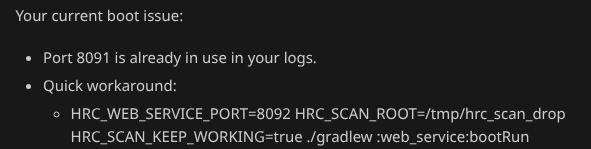

# Workshop IA - AI Coding Setup

Shared configuration for Claude Code and GitHub Copilot.

## What you get

- **3 MCP servers**: context7 (docs lookup), exa (web search), figma (design)
- **7 custom agents**: angular-architect, python-pro, java-architect, search-specialist, typescript-pro, devops-engineer, backend-developer
- **2 Angular skills** (Claude Code only): angular-developer, angular-new-app
- **Project instructions**: architecture decisions, testing conventions

## Prerequisites

- Node.js + npx (for MCP servers)
- Python 3.7+

## GitHub Copilot Setup

1. Clone the repo:

   ```bash
   git clone <repo-url>
   cd "workshop IA"
   ```
2. Edit `.vscode/mcp.json` and replace `YOUR_FIGMA_API_KEY` with your actual key.
3. Open Copilot Chat in **Agent mode** to use MCP tools and custom agents.

### how to do the .md:

I've avoided using copilot-instructions.md because they are considered as suggestions instead of instructions. .github/instructions/general.instructions.md has higher priority.

.md cookbook :

1. /init in copilote
2. remove 80% at least of what is in the .md because it is not usefull for every feature for example : -**Proxy**: Use `proxy.conf.json` for API proxying during development.
   also remove obvious things like : `README.md`: Setup instructions and project overview.
3. add what is still in copilote-instructions.md at the beginnig of general.instructions.md
4. remove copilote-instructions.md

### Prompting :

In agent mode using Bypasse Approval mode : add the heatmap on top of each swimmlane . The heatmap is per devlopper one line per dev. remove the more or less indicator nd remove the m and f part.

### Copilot "Backseating" vs. Solving

The downside of Copilot is that generally compared to competition it is "backseating" instead of solving". The AI gives you instructions or workarounds to do yourself instead of actually solving the problem.. We are trying to limit this tendancy.



### No subagents

Subagent echosystem is amateurish in copilote so we will avoid using it. Best i could find is some obscure pattern online: https://github.com/ShepAlderson/copilot-orchestra.

### Understanding hooks in detail :

> [!WARNING]
> Hooks are **bash scripts** and do **not work on Windows** natively. You need [Git Bash](https://git-scm.com/downloads), [WSL](https://learn.microsoft.com/en-us/windows/wsl/install), or [Cygwin](https://www.cygwin.com/) to run them. `jq` must also be installed separately on Windows. macOS and Linux are fully supported out of the box.


You can find them there [.claude/hooks](.claude/hooks).

```bash
  # 7. Check mapper not in controller layer
  if echo "$FILE_PATH" | grep -qP '(service|repository)/.*Mapper\.java$'; then
    VIOLATIONS+="MAPPER LOCATION: DTO mappers should be in the controller layer, not service/repository.
```

You should add hooks if the rule that you want to implement can be recognize without requiring an llm.

Genrally let the llm write the hooks.

If you need an llm to identifie the use case...

### Understanding skills in detail:

Each skill is a `SKILL.md` with two parts:

- **Frontmatter `description`** — always loaded, even when the skill doesn't trigger. Keep it to one sentence: it's a trigger condition, not docs. Every token here costs computation on every request.
- **Body** — only loaded when the skill triggers. This is where the real instructions live, with links to a `references/` subfolder for on-demand deep-dives.

**Part 1 — Frontmatter (the trigger):**

```yaml
---
name: angular-developer
description: Generates Angular code and provides architectural guidance. Trigger when
  creating projects, components, or services, or for best practices on reactivity
  (signals, linkedSignal, resource), forms, dependency injection, routing, SSR...
---
```

This is all the model sees until it decides to activate the skill. Keep it tight.

**Part 2 — Body (the real instructions):**

```markdown
## Forms

In most cases for new apps, **prefer signal forms**. When making a forms decision:

- v21 or newer → **signal forms**
- older apps → match the existing form strategy

- **Signal Forms**: Read [signal-forms.md](references/signal-forms.md)
- **Reactive forms**: Read [reactive-forms.md](references/reactive-forms.md)
```

Each topic links to a file in `references/` that is only read when that specific topic comes up — routing questions load `route-guards.md`, testing questions load `testing-fundamentals.md`, etc. The main `SKILL.md` stays lean.

See the full file: [angular-developer/SKILL.md](claude-config/skills/angular-developer/SKILL.md)
